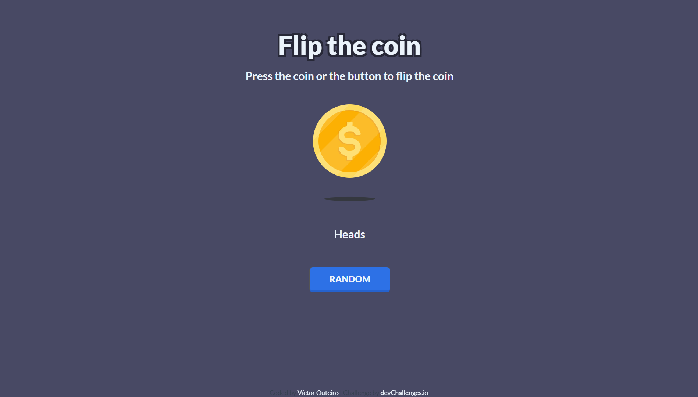

<!-- Please update value in the {}  -->

<h1 align="center">{Flip The Coin Master} | devChallenges</h1>

   Solution for a challenge <a href="https://devchallenges.io/challenge/flip-the-coin" target="_blank">Flip The Coin</a> from <a href="http://devchallenges.io" target="_blank">devChallenges.io</a>.

  <h3>
    <a href="https://flip-the-coin-five.vercel.app/">
      Demo
    </a>
     | 
    <a href="https://github.com/Radu-A/flip_the_coin">
      Solution
    </a>
     | 
    <a href="https://devchallenges.io/challenge/flip-the-coin">
      Challenge
    </a>
  </h3>

<!-- TABLE OF CONTENTS -->

## Table of Contents

- [Overview](#overview)
  - [What I learned](#what-i-learned)
  - [Useful resources](#useful-resources)
- [Built with](#built-with)
- [Features](#features)
- [Contact](#contact)

## Overview

### What I learned

The project has been developed in vanilla javascript, so no framework were used. The goal was to practise the DOM management. I would highlight three main challenges:

- Use transitions to rotate and hide one image and rotate and show another image.
- The management of randomness.
- The proper use of "setTimeOut".

### Useful resources

- [MDN - CSS Transitions](https://developer.mozilla.org/en-US/docs/Web/CSS/CSS_transitions) - A great guide to learn how to use transitoins on CSS.
- [MDN - setTimeout()](https://developer.mozilla.org/es/docs/Web/API/Window/setTimeout) - All the necesary information to use this method.

### Built with

- Semantic HTML5 markup
- CSS custom properties
- Flexbox
- Vanilla Javascript

## Features

The main challenge is to show a coin that you can flip:
- If you click on the coin, this will flip and show her other side.
- If you click on the button, the coin will flip a random number of times.

This application/site was created as a submission to a [DevChallenges](https://devchallenges.io/challenges-dashboard) challenge.

## Author

- GitHub [@Radu-A](https://github.com/Radu-A)
